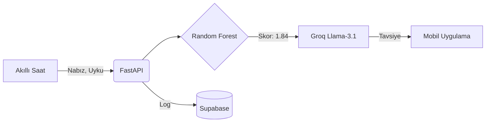

<div align="center">
  
  
  <h1>🌟 Zlife - AI Powered Life Coach</h1>
  <p><strong>Transforming smartwatch data into personalized, real-time life coaching using Machine Learning and Groq Llama-3.</strong></p>

  [](https://fastapi.tiangolo.com/)
  [](https://www.python.org/)
  [](https://groq.com/)
  [](https://scikit-learn.org/)
</div>

<br>

Zlife, akıllı saatlerden gelen verileri (uyku, nabız, hareketlilik) analiz ederek gerçek zamanlı **Klinik Yorgunluk Skoru (1-5)** hesaplayan ve **Groq (Llama-3.1)** Yapay Zekası aracılığıyla kişiselleştirilmiş motivasyon mesajları üreten akıllı bir arka uç (backend) sistemidir.

## 🧠 Sistem Mimarisi (Architecture)
Zlife, iki farklı beynin (Sol Lob ve Sağ Lob) birleşimiyle çalışır:

1. **Sol Lob (Analitik Zeka):** `Random Forest Regressor` (Gözetimli Öğrenme). Saat verilerini analiz edip yorgunluk skorunu çıkarır.
2. **Sağ Lob (İletişim Zekası):** `Groq Llama-3.1-8b-instant`. Çıkan sayısal skoru alıp kullanıcıya şefkatli bir yaşam koçu gibi seslenir.



## 📊 Veri Seti Referansı (Dataset Citation)
Bu projenin Makine Öğrenimi modeli, açık kaynaklı **PMData** veri seti kullanılarak eğitilmiştir (1480 günlük Ground Truth verisi). Araştırma ekibine bilime yaptıkları bu katkıdan dolayı teşekkür ederiz.

**Kaggle Linki:**
> [PMData - A sports logging dataset (Kaggle)](https://www.kaggle.com/datasets/vlbthambawita/pmdata-a-sports-logging-dataset)

**Akademik Referans (Citation):**
> Thambawita, V., Hicks, S.A., Borgli, H., et al. PMData: a sports logging dataset. *Sci Data 7*, 231 (2020). 
> [https://doi.org/10.1038/s41597-020-00573-0](https://doi.org/10.1038/s41597-020-00573-0)

## 🚀 Kurulum (Installation)
1. Repoyu klonlayın:
   ```bash
   git clone https://github.com/Kayra-ML/Zlife.git
   cd Zlife/backend
   ```
2. Bağımlılıkları yükleyin:
   ```bash
   pip install -r requirements.txt
   ```

## 🔒 Çevre Değişkenleri (.env)
Projenin çalışması için gereken API anahtarları `.gitignore` kuralı gereği GitHub'a yüklenmez. 
`backend/.env.example` dosyasını kopyalayarak `backend/.env` dosyası oluşturun:
```env
GROQ_API_KEY=your_groq_api_key_here
SUPABASE_URL=your_supabase_url_here
SUPABASE_KEY=your_supabase_anon_key_here
```

## ⚡ API Kullanımı
Sunucuyu başlatmak için:
```bash
uvicorn main:app --reload
```
**Endpoint:** `POST /api/health-data`
```json
{
  "user_id": "macbook_flutter_01",
  "overall_sleep_score": 45,
  "deep_sleep_in_minutes": 15,
  "resting_heart_rate": 85,
  "restlessness": 0.25,
  "timestamp": "2026-07-21T10:00:00Z"
}
```
