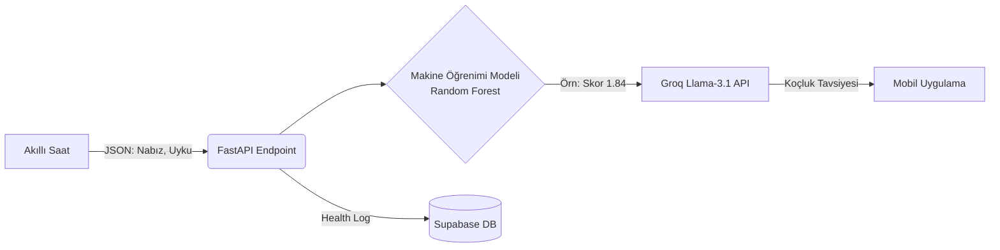

<div align="center">
  
  
  <h1>🌟 Zlife - AI Powered Life Coach</h1>
  <p><strong>Transforming smartwatch data into personalized, real-time life coaching using Machine Learning and Groq Llama-3.</strong></p>

  [](https://fastapi.tiangolo.com/)
  [](https://www.python.org/)
  [](https://groq.com/)
  [](https://scikit-learn.org/)
  [](https://supabase.com/)
</div>

---

## 📖 Proje Hakkında (About)
**Zlife**, sıradan akıllı saat verilerini (uyku süresi, dinlenik nabız, hareketlilik) alarak, kullanıcıya tıbbi bir hassasiyetle yorgunluk skoru çıkaran ve bu skoru insansı bir yaşam koçuna dönüştüren akıllı bir arka uç (backend) mimarisidir. 

Proje, sadece statik bildirimler göndermek yerine; makine öğrenimi modellerinin analitik gücü ile büyük dil modellerinin (LLM) empati yeteneğini birleştirerek, benzersiz ve anlık bir **"Kişisel Dijital Koç"** deneyimi sunar.

---

## ✨ Temel Özellikler (Key Features)
- **🧠 İki Loblu Zeka Mimarisi:** İstatistiksel analizleri bir ML modeli, dil ve iletişim süreçlerini ise bir LLM modeli yönetir.
- **⚡ Ultra Hızlı Inference:** Dünyanın en hızlı yapay zeka işlemcisi olan Groq (Llama-3.1) ile saniyenin onda biri hızında koçluk yanıtları.
- **📊 Gözetimli Öğrenme:** Gerçek sporcuların verileriyle (PMData) eğitilmiş Random Forest Regressor algoritması sayesinde yüksek isabetli klinik yorgunluk skoru tespiti.
- **☁️ Modern Backend:** FastAPI tabanlı asenkron REST API ve Supabase bulut veritabanı loglama altyapısı.

---

## 🏗️ Sistem Mimarisi (Architecture)
Sistemimiz, tıpkı bir insan beyni gibi iki ana lobun kusursuz uyumuyla çalışır:

1. **Sol Lob (Analitik Zeka):** `Random Forest Regressor`. Saat verilerini işler ve 1 (Çok Yorgun) ile 5 (Zinde) arasında klinik bir skor çıkarır.
2. **Sağ Lob (İletişim Zekası):** `Groq Llama-3.1-8b`. Sol lobdan gelen bu skoru ve uyku verilerini alarak, Türkçe ve şefkatli bir koçluk metni sentezler.



---

## 📈 Model Performansı (ML Metrics)
Zlife'ın temelini oluşturan makine öğrenimi modeli, 1480 günlük gerçek insan sağlığı verisi üzerinde eğitilmiştir.
- **Algoritma:** Random Forest Regressor
- **Mean Squared Error (MSE):** `0.51`
- **Hedef Değişken:** Ground Truth Fatigue Score (1-5)

---

## 🚀 Kurulum (Installation)

Sistemi kendi bilgisayarınızda (Localhost) çalıştırmak için aşağıdaki adımları izleyin:

```bash
# 1. Repoyu bilgisayarınıza klonlayın
git clone https://github.com/Kayra-ML/Zlife.git
cd Zlife/backend

# 2. Gerekli Python kütüphanelerini yükleyin
pip install -r requirements.txt
```

### Çevre Değişkenleri (.env)
Güvenlik sebebiyle API anahtarları repoya yüklenmez. `backend` klasörü içinde bir `.env` dosyası oluşturun ve aşağıdaki anahtarları girin:
```env
GROQ_API_KEY=your_groq_api_key_here
SUPABASE_URL=your_supabase_url_here
SUPABASE_KEY=your_supabase_anon_key_here
```

---

## ⚡ API Kullanımı
Sunucuyu başlatmak için backend klasörü içindeyken şu komutu çalıştırın:
```bash
uvicorn main:app --reload
```

### Örnek İstek (POST Request)
**Endpoint:** `http://127.0.0.1:8000/api/health-data`

```json
{
  "user_id": "macbook_flutter_01",
  "overall_sleep_score": 45,
  "deep_sleep_in_minutes": 15,
  "resting_heart_rate": 85,
  "restlessness": 0.25,
  "timestamp": "2026-07-21T10:00:00Z"
}
```

---

## 📊 Veri Seti Referansı (Dataset Citation)
Bu projenin Makine Öğrenimi modeli, P. Thambawita ve ekibi tarafından yayınlanan açık kaynaklı **PMData** veri seti kullanılarak eğitilmiştir. Araştırma ekibine bilime yaptıkları bu açık kaynaklı katkıdan dolayı sonsuz teşekkür ederiz.

- **Kaggle Linki:** [PMData - A sports logging dataset](https://www.kaggle.com/datasets/vlbthambawita/pmdata-a-sports-logging-dataset)
- **Akademik Referans (Citation):**
> Thambawita, V., et al. "PMData: a sports logging dataset." *Proceedings of the 11th ACM Multimedia Systems Conference*. 2020. [https://doi.org/10.1145/3339825.3394926](https://doi.org/10.1145/3339825.3394926)
